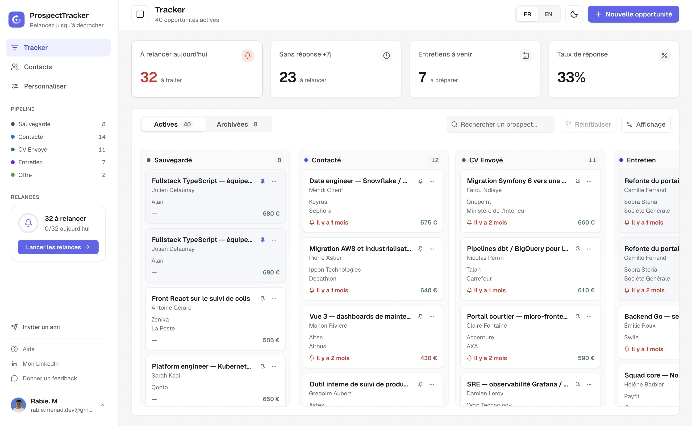
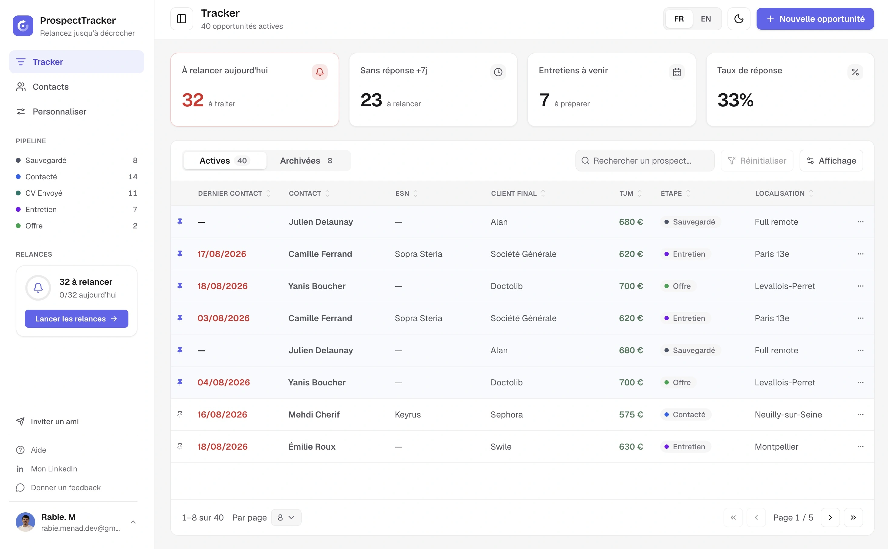

# ProspectTracker

**The prospecting tracker built for the freelance mission cycle** — smart follow-ups
and a view that drives action ("who do I follow up with today?") rather than
contemplation.

Freelancers, work-study students and job seekers track their prospecting by hand
(Notion, Excel, gut feeling): no automatic follow-ups, no scoring, no reason to open the
tool in the morning. ProspectTracker is the daily action-oriented work tool that fixes
that.

### Kanban view



### List view


## Features

- **Tracker, in two views** — one page, one set of filters (search, Active/Archived tabs,
  "due for follow-up"), drawn as a list or a board:
  - **List** — sortable columns, server-side pagination, pinned rows on top, stage badges
    and day-rate coloring against your reference rate.
  - **Kanban** — one column per stage; drag a card to change its stage, with edge
    scrolling, or use the card's menu from the keyboard. Moves and pins apply instantly.
  - **Display menu** — switch view and hide columns. The choice is remembered for the next
    visit.
- **Follow-ups** — each stage has its own follow-up delay; due opportunities are flagged,
  counted in the sidebar and opened in one click ("Lancer les relances").
- **Action KPIs** — to follow up today, no reply after 7 days, upcoming interviews, response
  rate.
- **Opportunities** — created, edited, archived and deleted from one side panel, with their
  linked contacts.
- **Contacts** — people reusable across opportunities, with their history; searchable by
  phone number while the person is on the line.
- **Configurable pipeline** — rename, recolor, reorder and archive your own stages, job
  types and experience levels, and set the reference day rate (no fixed enums).
- **Auth** — email + password and Google sign-in (Supabase).
- **French and English**, light and dark themes, mobile layout.

Not built yet: the public landing page, email reminders (Vercel cron + Resend) and the
no-account guest mode. See [`docs/PRD.md`](docs/PRD.md).

## Stack

TanStack Start (Router + SSR, Nitro) · TanStack Query · TanStack Table · TanStack Form ·
TypeScript (strict) · Tailwind CSS v4 · shadcn on Base UI · Pragmatic drag and drop ·
Motion · Paraglide (i18n) · Supabase (Postgres + Auth) · Drizzle ORM · Zod · Vitest ·
deployed on Vercel.

The app and the future landing page live in the **same TanStack Start app**: public routes
for the LP, protected routes for the dashboard. One repo, one deployment.

## Getting started

**Prerequisites:** Node 24 (`.nvmrc`), pnpm 10.

```bash
pnpm install
cp .env.example .env   # then fill in the values below
pnpm db:migrate        # create the schema
pnpm dev               # http://localhost:3000
```

Sign in once to create your user, then fill the tracker with realistic data:

```bash
pnpm db:seed -- --email=you@example.com
```

### Environment

| Variable                 | Description                                              |
| ------------------------ | -------------------------------------------------------- |
| `DATABASE_URL`           | Supabase Postgres connection string (transaction pooler) |
| `VITE_SUPABASE_URL`      | Supabase project URL (public)                            |
| `VITE_SUPABASE_ANON_KEY` | Supabase anon key (public, RLS-gated)                    |

### Database

```bash
pnpm db:generate   # generate a migration from the Drizzle schema
pnpm db:migrate    # apply migrations
pnpm db:seed       # seed opportunities for a user — see docs/reference/seed-data.md
pnpm db:studio     # browse the DB
```

## Scripts

```bash
pnpm dev            # dev server (SSR)
pnpm build          # production build
pnpm typecheck      # compile i18n messages and routes, then tsc --noEmit
pnpm lint           # ESLint
pnpm format         # Prettier --write
pnpm test           # Vitest
```

The CI runs `pnpm typecheck && pnpm lint:ci && pnpm format:check && pnpm test`; run the same
before opening a pull request.

## Documentation

- Product requirements: [`docs/PRD.md`](docs/PRD.md)
- Contributor guide & conventions: [`CLAUDE.md`](CLAUDE.md)
- Architecture decisions: [`docs/decisions/`](docs/decisions/)
- Data model: [`docs/reference/data-model.md`](docs/reference/data-model.md)
- Auth & SSR: [`docs/reference/auth.md`](docs/reference/auth.md) ·
  data access security: [`docs/reference/data-access-security.md`](docs/reference/data-access-security.md)
- Tracker: [list and server-side table](docs/reference/server-side-table.md) ·
  [kanban view](docs/reference/kanban-view.md) · [KPIs](docs/reference/kpis.md) ·
  [query prefetching](docs/reference/query-prefetching.md) ·
  [UI preferences](docs/reference/ui-preferences.md)
- Domain-free mechanisms: [table](docs/reference/table-mechanism.md) ·
  [board](docs/reference/board-mechanism.md) · [sortable lists](docs/reference/sortable-mechanism.md)
- Contacts: [`docs/reference/contacts.md`](docs/reference/contacts.md) ·
  Customization: [`docs/reference/customization.md`](docs/reference/customization.md)
- Design tokens: [`docs/reference/design-tokens.md`](docs/reference/design-tokens.md) ·
  internationalization (fr/en): [`docs/reference/i18n.md`](docs/reference/i18n.md)
- Seed data: [`docs/reference/seed-data.md`](docs/reference/seed-data.md)
